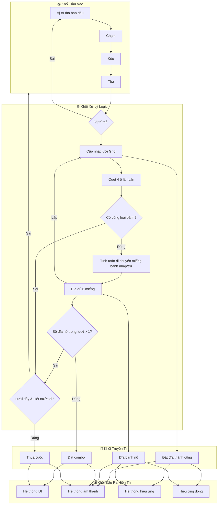

# ARCHITECTURE: Cheezy Savoround

**Last Updated:** 2026-05-23

> **AI CONTEXT:** This document is the authoritative technical reference. Read this FIRST for any technical question. Do not guess architectural patterns — verify here.

---

## 1. High-Level Structure

Trò chơi sử dụng cấu trúc Component-based kết hợp kiến trúc Manager (Singleton hoặc Event System) để quản lý luồng dữ liệu.

### Sơ đồ luồng (Game Flow Diagram)



- **Khối Đầu Vào:** Nhận thao tác Drag & Drop qua `Raycast`.
- **Khối Logic:** Cập nhật lưới Grid 3D, thuật toán quét 4 hướng (trên, dưới, trái, phải), tính toán luân chuyển miếng bánh và kiểm tra điều kiện (Nổ đĩa, Game Over).
- **Khối Truyền Tin:** Gửi sự kiện bằng Observer Pattern (Event System).
- **Khối Đầu Ra:** Hệ thống UI, Sound, VFX Particle, và Animation (Tweening, Slerp) phản hồi tương tác.

## 2. Identified Patterns

### Finite State Machine (FSM)

**Location:** Core Gameplay Loop (e.g., `GameManager` hoặc `GameStateManager`)
**Purpose:** Tránh lồng chéo biến boolean. Phân định rõ ràng các trạng thái `PlayingState`, `AnimatingState`, `CheckingComboState`, `GameOverState`.

### Observer Pattern (Event System)

**Location:** Cốt lõi giao tiếp giữa Logic và Hiển thị.
**Purpose:** Giảm Tight Coupling. UI và Audio sẽ lắng nghe (listen) các event như `OnPizzaMerged`, `OnComboAchieved` thay vì bị gọi trực tiếp từ code Logic.

### Object Pooling

**Location:** Hệ thống sinh vật thể.
**Purpose:** Tái sử dụng các Prefab sinh ra liên tục (Miếng bánh bay, VFX nổ, Text điểm số) nhằm triệt tiêu bộ thu gom rác (Garbage Collector).

### Data-Driven Design

**Location:** Cấu trúc Level và Item.
**Purpose:** Tách rời cấu hình ra khỏi code. Sử dụng JSON để lưu tiến trình (Vàng, Skin, Daily Reward) và cấu hình Level động.

## 3. Data Flow & Performance

- **Zero GC Alloc:** Trong hàm `Update()`, cấm tuyệt đối không dùng `GameObject.Find`, `GetComponent`, hay khởi tạo object mới (`new`).
- **Render Optimization:**
  - Gộp UI tĩnh vào Sprite Atlas.
  - Canvas tĩnh và động phải nằm trên 2 Canvas riêng biệt.
  - Sử dụng GPU Instancing và Static/Dynamic Batching cho mô hình 3D để giữ < 50 Batches.

## 4. Code Organization & Conventions

**Structure Approach:** Domain-based / Feature-based folders trong Unity (e.g., `Scripts/Core/`, `Scripts/UI/`, `Scripts/Data/`).
**File Naming:** PascalCase cho Class/Struct.
**Testing Strategy:** Play mode test bằng tay và Unity Test Framework (nếu cần).

## 5. Structural Tree (Unity Assets)

```
Assets/
├── Prefabs/        (Pizza, GridCells, VFX)
├── Scripts/
│   ├── Core/       (FSM, GridLogic)
│   ├── UI/         (Menus, HUD, Shop)
│   ├── Data/       (JSON parser, ScriptableObjects)
│   └── Utils/      (ObjectPool, Extensions)
├── Art/            (Models, Materials, Sprite Atlas)
└── Scenes/         (Main, Gameplay)
```

## 6. Shared Utilities & Core APIs (Danh mục hàm cốt lõi đã xây dựng)

Dưới đây là các hàm quan trọng đã được viết trong quá trình thực hiện Tuần 1 (Grid & Tray Logic) để ghi nhớ và tái sử dụng cho các hệ thống tiếp theo:

### LevelManager (`Scripts/Core/LevelManager.cs`)

- `LoadLevel(int levelId)` / `LoadFromTextAsset(TextAsset jsonFile)`: Lớp duy nhất (Nhạc trưởng) chịu trách nhiệm đọc và parse cấu hình màn chơi JSON.
- Đọc xong sẽ phân phối tham số `gridWidth`, `gridHeight` cho `GridManager` và `holdSlotCount` cho `TrayManager`.
- Quản lý hàm `OnDrawGizmos` tập trung để hiển thị lưới & khay trên Editor test.

### GridManager (`Scripts/Core/GridManager.cs`)

- `GenerateGrid(int levelId, int width, int height)`: Nhận thông số từ `LevelManager` để sinh mạng lưới Grid 3D ra giữa màn hình. Tích hợp thuật toán **Checkerboard** (lẻ/chẵn) xen kẽ.
- `ClearGrid()`: Dọn dẹp object lưới cũ trên scene.
- `DrawGizmos(int width, int height)`: Vẽ khung preview cho Editor.
- `GetCell(Vector2Int gridPos)`: Lấy nhanh tham chiếu `GridCell` dựa trên tọa độ mặt phẳng 2D. Rất hữu ích cho các thuật toán tìm đường hoặc lan truyền.
- `CheckAdjacentCells(Vector2Int centerPos)`: Lõi thuật toán quét 4 hướng (Trên, Dưới, Trái, Phải). Hiện đang dùng để test in ra log, nhưng thiết kế sẵn sàng trả về `List<GridCell>` để phục vụ logic gộp bánh (Merge) cho Tuần 2.

### TrayManager (`Scripts/Core/TrayManager.cs`)

- `GenerateTray(int slotCount)`: Nhận thông số từ `LevelManager` để sinh khay chờ đĩa. Tự động tính khoảng cách và căn giữa theo trục X. Tích hợp thuật toán **Checkerboard** (chẵn/lẻ) giống GridManager.
- `ClearTray()`: Hủy toàn bộ Hold Slots hiện có.
- `DrawGizmos(int slotCount)`: Vẽ khung preview cho Editor.

### LevelGenerator (`Scripts/Editor/LevelGenerator.cs`)

- `Generate()`: Công cụ Tooling sinh hàng loạt file JSON (`Tools > Generate 30 Levels`). Giúp team tạo Data giả lập nhanh chóng.

### Cấu trúc Data (`Scripts/Data/LevelData.cs`)

- `LevelData`: Class map dữ liệu `[Serializable]` chung cho mọi hệ thống (gồm `levelId`, `gridWidth`, `gridHeight`, `holdSlotCount`). Có thể mở rộng (thêm ma trận đĩa bánh) trong tương lai.

### Kéo Thả & Logic Lưới (Hệ thống Drag & Drop)

- **PizzaPlate (`Scripts/Gameplay/PizzaPlate.cs`)**
  - `Initialize(Transform parentSlot)`: Thiết lập vị trí ban đầu của đĩa trên khay.
  - `PickUp()`: Nhấc đĩa lên theo trục Y để bắt đầu kéo.
  - `DragTo(Vector3 worldPosition)`: Di chuyển toạ độ (X, Z) của đĩa bám theo chuột.
  - `ReturnToOriginalSlot()`: Bay về khay xuất phát nếu thả trượt lưới.
  - `PlaceAt(Vector3 targetPos, Transform newParent)`: Gọi khi gài đĩa thành công vào lưới (chuyển cha và lưu vị trí mới).

- **GridCell (`Scripts/Gameplay/GridCell.cs`)**
  - Gắn kèm trên mỗi ô `_cellPrefab`.
  - `Initialize(Vector2Int gridPos)`: Gán toạ độ 2D cho ô lưới.
  - `PlacePlate(PizzaPlate plate)`: Thực hiện **Snapping** - ép toạ độ đĩa vào đúng tâm của ô cờ caro. Đánh dấu ô đã có đĩa (`IsOccupied = true`).

- **InputManager (`Scripts/Core/InputManager.cs`)**
  - Controller chính xử lý vòng lặp kéo thả `Mouse Down -> Mouse Drag -> Mouse Up`.
  - Bắn 2 tia Raycast riêng biệt: một tia tìm Đĩa, một tia cắm xuống đất tìm Lưới.
  - **Cải tiến chống che khuất (Occlusion Fix):** Bắt buộc sử dụng `Physics.RaycastAll` thay vì `Raycast` thường trong lúc thả đĩa (Drop). Việc này giúp tia bắn xuyên qua các đĩa có sẵn ở ô lân cận (bị lẹm do góc chéo camera perspective), đảm bảo luôn snap trúng ô đất trống phía dưới.
  - Event `OnPlatePlaced(PizzaPlate, GridCell)`: Phát ra khi người chơi đặt đĩa thành công (dành cho hệ thống UI/Âm thanh hoặc bộ quét 4 hướng lắng nghe về sau).
